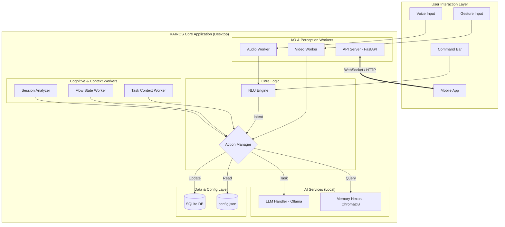

# K.A.I.R.O.S. - A Symbiotic AI Desktop Assistant


**K.A.I.R.O.S. (Kinetic Artificial Intelligence for Responsive & Organic Systems)** is a context-aware, multi-modal AI desktop assistant designed to create a symbiotic link between your PC and mobile devices, proactively assisting in workflows and automating tasks.

---


_A placeholder for your awesome project demo!_

---

## Core Concept 🧠

K.A.I.R.O.S. is not just another voice assistant. It's an **ambient computing experiment** built on a local-first philosophy. It observes your workflow, understands your context, and anticipates your needs without constantly sending your data to the cloud. By linking your desktop and mobile device, it aims to erase the boundary between your main workstation and your handheld companion.

---

## Key Features ✨

* **🗣️ Multi-Modal Interaction:** Control your desktop using **voice commands**, **hand gestures**, a floating **command bar**, or the **mobile companion app**.

* **🧠 Proactive Intelligence:** K.A.I.R.O.S. watches for repetitive workflows and uses a local LLM to **suggest new automation macros** on the fly. Its "Guardian Mode" detects when you're in a flow state and can be configured to silence distractions.

* **🧬 Adaptive Personality:** Provide feedback like "be more concise" or "that was helpful," and the AI's personality traits (**verbosity, formality, proactivity**) will adjust over time.

* **🔗 Symbiotic PC-Mobile Link:**
    * **Shared Clipboard:** Copy on your PC, paste on your phone, and vice-versa.
    * **File Handoff:** Seamlessly transfer a document you're reading on your PC to your phone, opening it to the exact same page.
    * **Browser Handoff:** Send the webpage you're viewing on your PC directly to your phone's browser.
    * **Notification Mirroring:** See your phone's notifications on your desktop dashboard.

* **🤖 Dynamic Task Execution:** Ask K.A.I.R.O.S. to perform complex tasks. It uses a local LLM (**Phi-3**) to write, review, and execute sandboxed Python scripts to get the job done.

* **LOCAL FIRST & PRIVACY-FOCUSED:** All core AI models (Transcription, NLU, Speaker Verification, LLM) run **100% locally on your machine**. Your data stays with you.

* **🛠️ Customizable & Extensible:**
    * Create custom voice commands and complex macros through the UI.
    * The UI is **generative**, reconfiguring itself based on your current task (e.g., "Coding" vs. "Browsing").
    * A simple plugin system allows for easy expansion of capabilities.

---

## Architecture Overview 🏗️

K.A.I.R.O.S. is built on a decoupled, multi-threaded architecture to ensure the UI remains responsive while handling numerous background tasks.



---

## 🛠️ Tech Stack

| Category           | Technologies                                                                                        |
| ------------------ | --------------------------------------------------------------------------------------------------- |
| **Backend** | Python, PySide6 (Qt), FastAPI, Uvicorn, Playwright                                                  |
| **AI / ML** | PyTorch, Sentence Transformers, OpenAI Whisper, SpeechBrain, Spacy, MediaPipe, Ollama (Phi-3)        |
| **Mobile Frontend**| Flutter, Dart, Provider, WebSocketChannel                                                           |
| **Databases & Tools**| SQLite, ChromaDB (Vector DB), Git, VS Code, PyInstaller                                             |

---

## Getting Started 🚀

Follow these steps to get K.A.I.R.O.S. running on your local machine.

### Prerequisites

* Python 3.11+
* Flutter SDK
* An NVIDIA GPU is **highly recommended** for better performance, but not strictly required.
* [Ollama](https://ollama.com/) installed and running for dynamic task execution.

### Installation

1.  **Clone the repository:**
    ```sh
    git clone <your-repo-url>
    cd kairos_project
    ```

2.  **Set up the Python Environment:**
    ```sh
    # Create a virtual environment
    python -m venv venv

    # Activate it
    # On Windows:
    .\venv\Scripts\activate
    # On macOS/Linux:
    # source venv/bin/activate

    # Install dependencies
    pip install -r requirements.txt
    ```

3.  **Download AI Models:**
    The first time you run the app, the required models (Whisper, SpeechBrain, etc.) will be downloaded automatically. This may take some time.

4.  **Pull the Local LLM:**
    Make sure Ollama is running and pull the Phi-3 model:
    ```sh
    ollama pull phi3
    ```

5.  **Voice Enrollment (CRITICAL STEP):**
    You must enroll your voice before the first launch.
    ```sh
    python enroll_voice.py
    ```
    Follow the on-screen instructions to create your voiceprint.

6.  **Configure Environment Variables:**
    Rename the `.env.example` file to `.env`. If you plan to use Spotify integration in the future, you will need to add your credentials there.

7.  **Set up the Flutter App:**
    ```sh
    # Navigate to the mobile app directory
    cd kairos_mobile_app

    # Get dependencies
    flutter pub get

    # Return to the root directory
    cd ..
    ```

8.  **Launch K.A.I.R.O.S.!**
    ```sh
    python main.py
    ```

---

## 💡 Future Roadmap

-   [ ] **Advanced Spotify Integration:** Full playback control, playlist management, and song recommendations.
-   [ ] **Calendar & Email Plugin:** Add capabilities to read schedules and compose emails.
-   [ ] **Enhanced Memory System:** Enable the AI to form connections between memories and summarize past activities.
-   [ ] **Web-Based Configuration Dashboard:** A more powerful way to manage macros and settings.

---

## License

This project is licensed under the MIT License - see the [LICENSE](LICENSE.md) file for details.