# K.A.I.R.O.S. - A Symbiotic AI Desktop Assistant

**K.A.I.R.O.S.** (Kinetic Artificial Intelligence for Responsive & Organic Systems) is a context-aware, multi-modal AI desktop assistant designed to create a symbiotic link between your PC and mobile device, proactively assisting in workflows and automating tasks.

## Core Concept 🧠

K.A.I.R.O.S. is not just another voice assistant. It's a proactive computing system built on a local-first philosophy. It observes your workflow using background workers, understands your context (e.g., "coding" vs "browsing"), and anticipates your needs without constantly sending your data to the cloud. By linking your desktop and mobile device, it aims to erase the boundary between your main workstation and your handheld companion.

## Key Features ✨

### 🗣️ Multi-Modal Interaction
Control your desktop using voice commands (with biometric speaker verification), hand gestures, a floating command bar, or the mobile companion app.

### 🧠 Proactive Intelligence
K.A.I.R.O.S. watches for repetitive workflows using its SessionAnalyzer and leverages a local LLM to suggest new automation macros on the fly. Its FlowStateWorker can detect when you're in a state of deep work to manage future interactions.

### 🧬 Adaptive Personality
Provide feedback like "be more concise" or "that was helpful," and the AI's personality traits (verbosity, formality, proactivity) will adjust for future LLM-generated responses.

### 🔗 Symbiotic PC-Mobile Link

- **Shared Clipboard**: Copy on your PC, paste on your phone, and vice-versa.
- **Document Handoff**: Seamlessly transfer a PDF you're viewing on your PC to your phone, opening it to the same page.
- **Browser & Spotify Handoff**: Send the current webpage or Spotify song from your PC directly to your phone.
- **Headset Handoff**: Trigger your phone to connect to your Bluetooth headset, disconnecting it from the PC.
- **Notification Mirroring**: See your phone's notifications appear on your desktop dashboard.

### 🤖 Dynamic Task Execution
Ask K.A.I.R.O.S. to perform complex tasks. It uses a local LLM (Phi-3) to write, present for review, and execute sandboxed Python scripts using a toolbox of system primitives.

### 🔒 LOCAL FIRST & PRIVACY-FOCUSED
All core AI models (Transcription, NLU, Speaker Verification, LLM) run 100% locally on your machine. Your activity logs and long-term memory (vector database) are also stored locally.

### 🛠️ Customizable & Extensible

- Create custom voice commands and complex multi-step macros through the UI.
- The UI is generative, using the LLM to reconfigure the dashboard layout based on your current detected task.
- A simple plugin system allows for easy expansion of KAIROS's built-in capabilities.

## Architecture Overview 🏗️

K.A.I.R.O.S. uses a decoupled, multi-threaded architecture. A central MainWindow orchestrates various "Worker" threads that sense the environment and perform actions, ensuring the UI remains responsive.

```mermaid
graph TD
    subgraph User Interaction
        direction LR
        User((User))
        MobileApp[📱<br>Flutter App]
    end

    subgraph "K.A.I.R.O.S. Desktop Application"
        MainWindow["🖥️ MainWindow (UI Thread)"]

        subgraph "SENSE (Input Workers)"
            direction LR
            AudioWorker["🎤 Audio Worker<br>(Whisper, VAD, Speaker ID)"]
            VideoWorker["📹 Video Worker<br>(MediaPipe Gestures)"]
            ActivityLogger["📝 Activity Logger<br>(Window & Input Monitoring)"]
        end

        subgraph "THINK (The Brain)"
            ActionManager{"🧠 Action Manager<br>(Central Orchestrator)"}
            NluEngine["🗣️ NLU Engine<br>(Intent Recognition)"]
            LLMHandler["🤖 LLM Handler<br>(Phi-3 Interface)"]
            ProactiveEngine["🎯 Proactive Engine<br>(Flow, Task, Session Workers)"]
        end
        
        subgraph "ACT (Output & Services)"
            direction LR
            SpeakerWorker["🔊 Speaker Worker<br>(TTS Synthesis)"]
            ApiServer["🌐 API Server<br>(FastAPI & WebSocket)"]
            Automation["⚙️ System Automation<br>(pyautogui, playwright)"]
        end
        
        subgraph "MEMORY"
            direction LR
            SQLiteDB[("🗃️ SQLite DB<br>Feedback & Logs")]
            ChromaDB[("🧠 ChromaDB<br>Vector Memory")]
            Settings[("⚙️ config.json")]
        end
    end

    %% Data Flows
    User -- "Voice/Gestures/Text" --> MainWindow
    MobileApp <-- WebSocket --> ApiServer

    MainWindow -- "Raw Input" --> AudioWorker & VideoWorker & ActivityLogger
    
    AudioWorker -- "Transcription" --> NluEngine
    VideoWorker -- "Gesture Intent" --> ActionManager
    ActivityLogger -- "User Activity" --> ProactiveEngine
    
    NluEngine -- "Intent & Entities" --> ActionManager
    ProactiveEngine -- "Suggestions & Context" --> ActionManager
    ActionManager -- "Commands" --> SpeakerWorker & Automation & LLMHandler
    
    ActionManager -- "Read/Write" --> SQLiteDB & ChromaDB & Settings
    ApiServer -- "Commands from Mobile" --> ActionManager
```



## Tech Stack 🛠️

| Category | Technologies |
|----------|-------------|
| **Desktop App** | Python, PySide6 (Qt for Python) |
| **Mobile App** | Flutter, Dart |
| **Communication** | FastAPI, WebSockets, UDP (for discovery) |
| **AI / ML** | PyTorch, Sentence Transformers, OpenAI Whisper, SpeechBrain, MediaPipe, Ollama (Phi-3) |
| **Databases & Tools** | SQLite, ChromaDB (Vector DB), Pydantic |

## Getting Started 🚀

Follow these steps to get K.A.I.R.O.S. running on your local machine.

### Prerequisites

- Python 3.11+
- Flutter SDK installed and configured for mobile development
- An NVIDIA GPU is highly recommended for acceptable AI model performance
- Ollama installed and running

### Installation

1. **Clone the repository:**

   ```bash
   git clone https://github.com/your-username/kairos_project.git
   cd kairos_project
   ```

2. **Set up the Python Environment:**

   ```bash
   # Create and activate a virtual environment
   python -m venv venv
   .\venv\Scripts\activate

   # Install all dependencies
   pip install -r requirements.txt
   ```

3. **Download AI Models:**

   - **NLU & Spacy**: The first time you run `main.py`, the sentence-transformer and spacy models will be downloaded automatically.
   - **LLM**: Make sure the Ollama desktop application is running, then pull the Phi-3 model via terminal:

   ```bash
   ollama pull phi3
   ```

4. **Voice Enrollment (CRITICAL FIRST STEP):**

   You must create a voiceprint for the speaker verification to work.

   ```bash
   python enroll_voice.py
   ```

   Follow the on-screen instructions. This only needs to be done once.

5. **Set up the Flutter App:**

   ```bash
   cd kairos_mobile_app
   flutter pub get
   cd ..
   ```

6. **Launch K.A.I.R.O.S.!**

   Start the main desktop application from the root directory:

   ```bash
   python main.py
   ```

   Launch the mobile app on your connected device or emulator (e.g., from VS Code with F5).

## Future Roadmap 💡

- [ ] **Advanced Spotify Integration**: Full playback control and playlist management
- [ ] **Plugin Development**: Create plugins for calendar access, email, and other services
- [ ] **Enhanced Memory**: Enable the AI to form connections between memories and generate summaries of past activities
- [ ] **Web-Based Configuration**: A more powerful dashboard for managing macros, settings, and plugins

## License 📄

This project is licensed under the MIT License - see the [LICENSE](LICENSE) file for details.